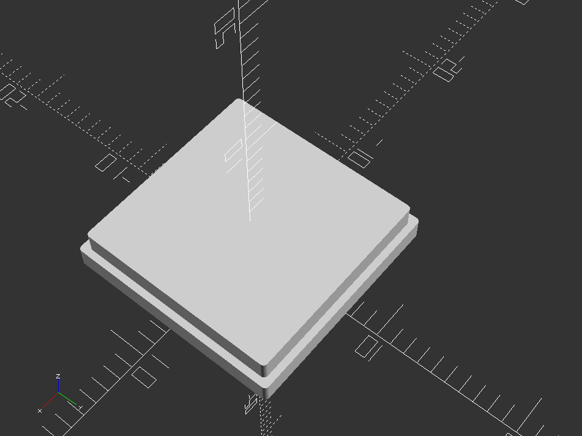
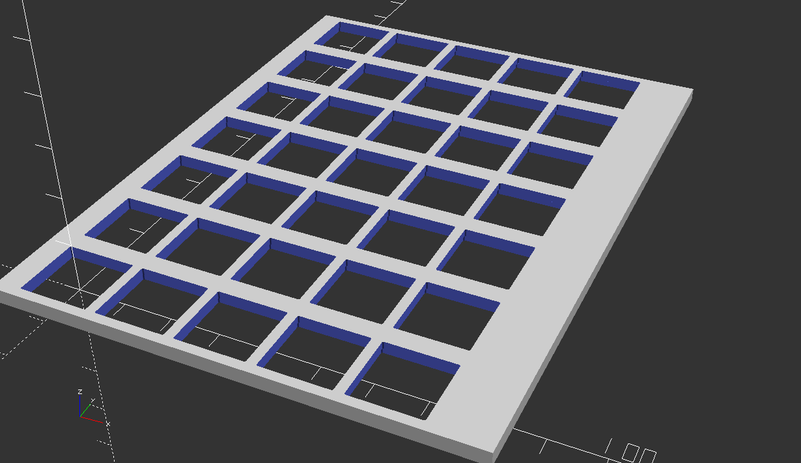
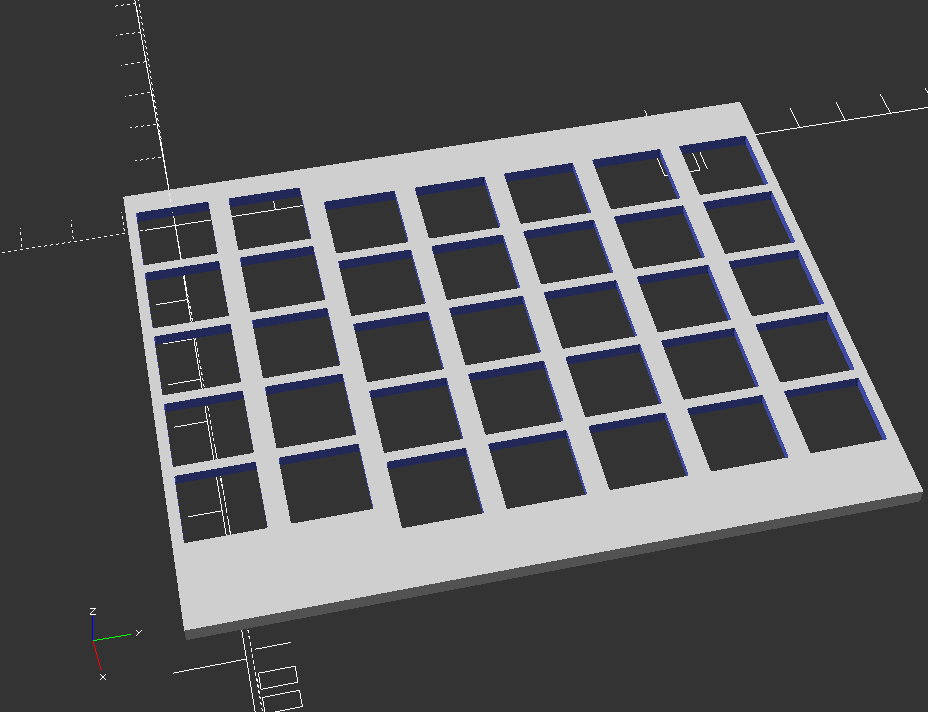
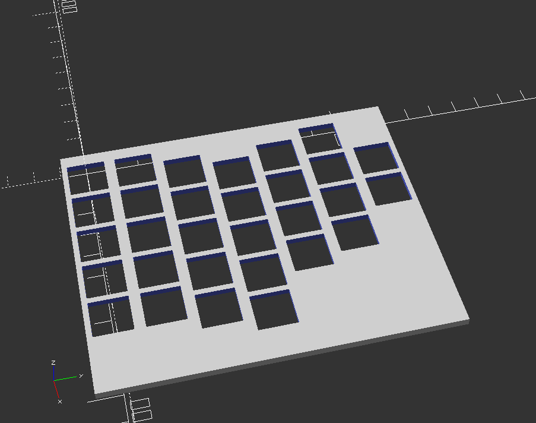

# couscous-kbd
Parametric OpenSCAD keyboard design

Inspired by MattDB's redox keyboard design on [thingiverse.com](https://www.thingiverse.com/thing:2704567) which is in turn inspired by the [Ergodox keyboard design](https://deskthority.net/wiki/ErgoDox).

I wanted to add some changes to the redox keyboard, but can't make a 3D design if my life depended on it, so I decided to build a parametric design in [OpenSCAD](http://www.openscad.org/) because I _can_ program. A bit.

First aim is to copy MattDB's design in parametric form.

Cherry MX Switch stencil:

## Samples

A 5x7 keyplate for Cherry MX switches.

A 5x7 keyplate for Cherry MX switches with variable top margins.

Demonstrating a variable number of keys per column, with variable top margins.

